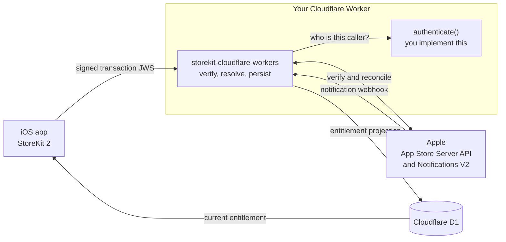
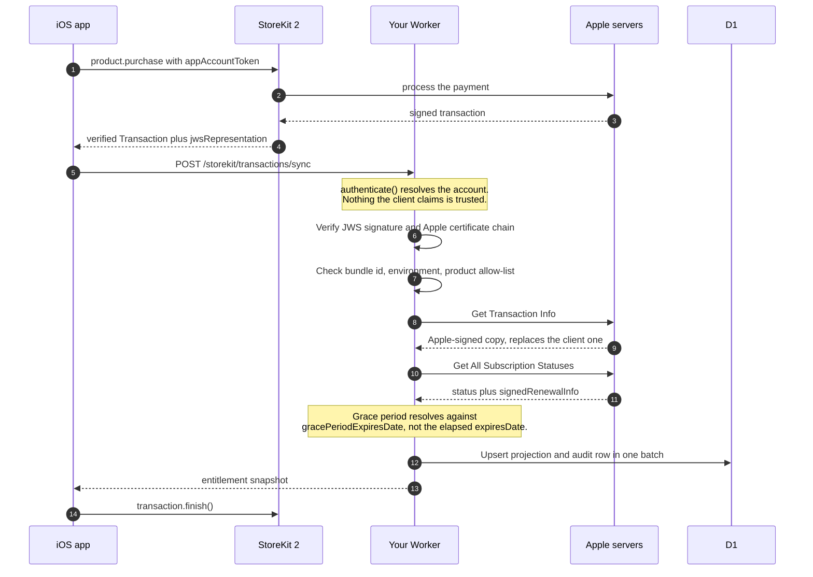
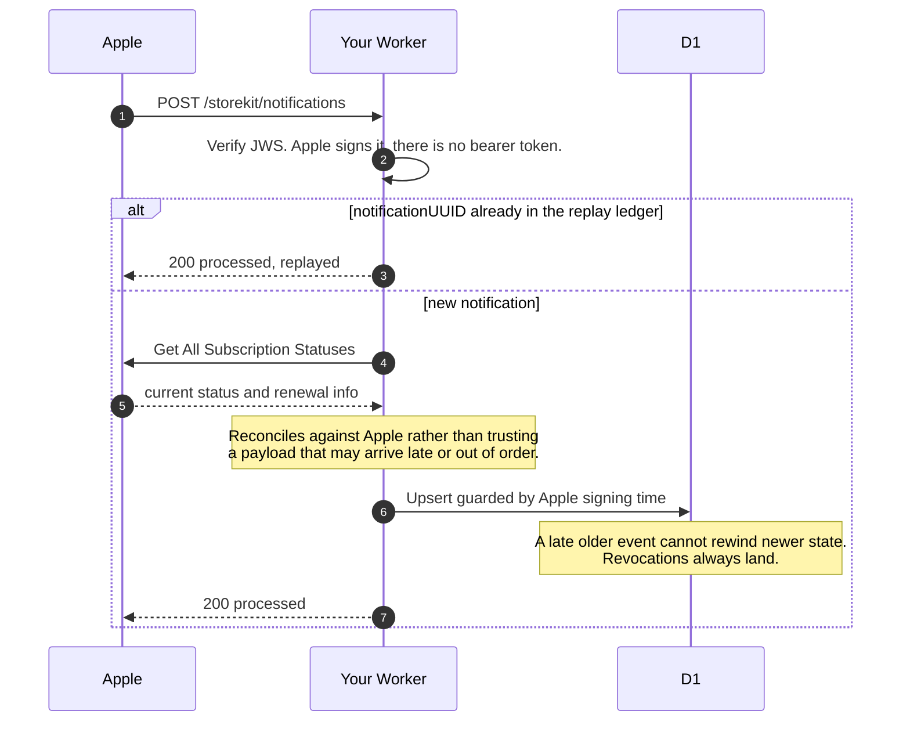
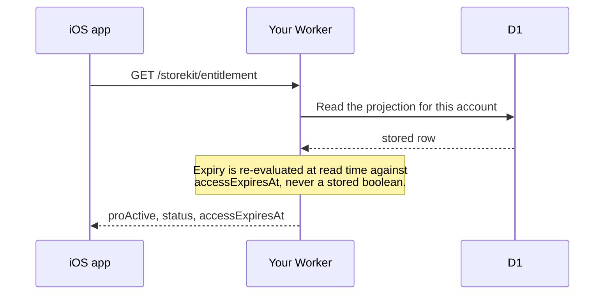

# storekit-cloudflare-workers

Drop-in, server-authoritative **StoreKit 2** for **Cloudflare Workers + D1**.

> **Independent project.** Not affiliated with, endorsed by, or sponsored by Apple Inc. or
> Cloudflare, Inc. "StoreKit", "App Store" and "Apple" are trademarks of Apple Inc.; "Cloudflare",
> "Workers" and "D1" are trademarks of Cloudflare, Inc. They are used here only to describe what
> this software interoperates with.

Copy one directory, apply one schema, set four secrets, mount one handler. You get Apple JWS
verification, a correct entitlement engine, idempotent App Store Server Notifications V2, and the
operational Apple calls, without writing any of it yourself.

```ts
import { createStoreKitHandler } from "./storekit"

const storekit = createStoreKitHandler<Env>({
  authenticate: async (request, env) => {
    const session = await mySessionFrom(request, env)
    return session ? { accountId: session.userId } : null
  }
})

export default {
  async fetch(request, env, ctx) {
    return (await storekit.fetch(request, env, ctx)) ?? myRoutes(request, env, ctx)
  }
}
```

That's the whole integration. `fetch` returns `null` for non-StoreKit paths, so it composes with
whatever router you already have.

---

## Why this exists

Server-side StoreKit has a handful of details that are easy to get wrong and expensive when you do.
This module gets them right, and the tests say so:

**A billing grace period does not mean "expired."** When a renewal fails, Apple keeps serving the
customer while it retries the payment, but the transaction's own `expiresDate` is already in the
past. Judge access on `expiresDate` and you cut off paying customers for the entire grace period.
This module resolves a separate `accessExpiresAt` from the verified `gracePeriodExpiresDate`.

**A free trial is not the same as an introductory offer.** `offerType === 1` also covers _paid_
pay-up-front and pay-as-you-go offers. Trials key off `offerDiscountType`.

**Notifications arrive out of order.** Apple does not guarantee delivery order and retries failed
deliveries for days. A late `DID_RENEW` landing after an `EXPIRED` will rewind your state unless
writes are guarded, and guarded on _Apple's_ signing time, because a late-arriving old event has a
newer server clock reading. Revocations bypass the guard, because a refund is terminal.

**`REFUND` carries no subscription status.** Handlers that only act on `data.status` never revoke
access on a refund.

**Non-consumables have no `expiresDate`.** Treating a missing expiry as expired revokes every
lifetime unlock.

---

## What you get

- **Verification**: signature and Apple certificate chain, bundle ID, environment, closed product
  allow-list, transaction identity, and an Apple re-lookup whose response only replaces the client
  copy after its identity claims match.
- **Entitlement policy**: paid, free trial, grace period, billing retry, expired, revoked,
  refunded, and perpetual, resolved from verified claims only. Pure and I/O-free, so you can test
  your tier rules against plain objects.
- **Renewal metadata**: auto-renew status and product, expiration intent, billing retry, price
  increase status, renewal price and currency.
- **Persistence**: entitlement projection, transaction audit trail, and a notification replay
  ledger in D1, written in atomic batches.
- **A mountable handler**: sync, entitlement read, and the Apple webhook, with request validation
  and error mapping that never leaks which check rejected a payload.
- **Config validation**: every problem reported at once, secret presence without secret values.
- **Operational Apple calls**: test notifications, notification-history replay for outage
  recovery, transaction and refund history, order lookup, renewal-date extension, and consumption
  information for `CONSUMPTION_REQUEST`.

## What you supply

**Authentication.** A StoreKit transaction proves _that a purchase happened_, never _who it belongs
to_. Only your app knows that, so `authenticate` is yours to implement. It ships failing closed.

---

## How it fits together



Two arrows leave your side of the diagram: the client sends Apple-signed material, and
`authenticate` says who the caller is. Everything else is the module's job.

## Request flows

### A purchase

The standard StoreKit 2 integration. The client never sends product status, expiry, price, or a
premium flag; only the signed transaction, which the server re-verifies against Apple before
trusting a single claim in it.



Finish the transaction only after the server confirms, or a network failure drops the purchase from
the client queue before the backend recorded it.

### A renewal, cancellation, or refund

Apple pushes these; the customer is not in the app when they happen. This is what keeps the
projection true between syncs.



### Reading the entitlement



---

## Setup

### 1. Get the code

Either clone this repository as a standalone Worker, or vendor the module into an existing one:

```bash
cp -r src/storekit /path/to/your-worker/src/
npm install @apple/app-store-server-library
```

The directory imports nothing outside itself except the Apple library; a test enforces that, so it
stays copyable.

### 2. Configure Wrangler

```jsonc
{
  "compatibility_date": "2026-08-03",
  "compatibility_flags": ["nodejs_compat"], // required: the Apple library needs Node built-ins
  "vars": {
    "STOREKIT_ALLOWED_ENVIRONMENTS": "Production",
    "STOREKIT_BUNDLE_ID": "com.example.app",
    "STOREKIT_ALLOWED_PRODUCT_IDS": "com.example.app.pro.monthly",
    "APP_STORE_APP_APPLE_ID": "1234567890"
  },
  "d1_databases": [{ "binding": "STOREKIT_DB", "database_name": "...", "database_id": "..." }]
}
```

Using a different binding name? Pass it through: `database: (env) => env.MY_DB`.

### 3. Create the tables

```bash
npx wrangler d1 create storekit-cloudflare-workers   # copy the id into wrangler.jsonc
npm run db:migrate:remote                    # or: wrangler d1 execute <DB> --file=src/storekit/schema.sql
```

### 4. Set the Apple secrets

```bash
npx wrangler secret put APP_STORE_CONNECT_ISSUER_ID
npx wrangler secret put APP_STORE_CONNECT_KEY_ID
npx wrangler secret put APP_STORE_CONNECT_PRIVATE_KEY   # the whole .p8, BEGIN/END lines included
npx wrangler secret put APPLE_ROOT_CERTIFICATES_PEM     # concatenated Apple roots
```

Where each value comes from, and how to convert Apple's root certificates to PEM, is in
[`docs/configuration.md`](docs/configuration.md).

### 5. Implement `authenticate`, then deploy

```bash
npm run release:check && npm run deploy
```

Check `GET /health`: it runs `describeStoreKitConfig` and lists every configuration problem,
reporting which secrets are present without ever revealing a value.

### 6. Point Apple at the webhook

In App Store Connect > your app > **App Information > App Store Server Notifications**, set the
**Version 2** URL to `https://your-worker.example.com/storekit/notifications`. Then prove it works:

```ts
await requestStoreKitTestNotification(env)
```

---

## Routes

| Method | Path                          | Authentication        |
| ------ | ----------------------------- | --------------------- |
| `POST` | `/storekit/transactions/sync` | your `authenticate`   |
| `GET`  | `/storekit/entitlement`       | your `authenticate`   |
| `POST` | `/storekit/notifications`     | Apple's JWS signature |

Override any path via `paths: { sync: "/api/v1/iap/sync" }`.

## The iOS side

Send only Apple-signed material. The server ignores any client-asserted status, expiry, price, or
premium flag.

```swift
for await result in Transaction.updates {
    guard case .verified(let transaction) = result else { continue }
    try await api.post("/storekit/transactions/sync", [
        "signedTransactionJWS": result.jwsRepresentation
    ])
    await transaction.finish()
}
```

Call sync after purchase, after restore, on `Transaction.updates`, and at launch. Gate features on
**`accessExpiresAt`**, not `expiresAt`.

Setting `appAccountToken` on `Product.purchase` and pinning it via `expectedAppAccountToken` in
`authenticate` is what stops a signed transaction being replayed onto another account.

---

## Beyond the bundled routes

The service layer has no HTTP dependency, so a GraphQL API, Durable Object or queue consumer can
call it directly:

```ts
const { snapshot } = await syncStoreKitTransaction(
  {
    signedTransactionJWS,
    installationId: userId,
    appBundleId,
    expectedAppAccountToken
  },
  { apple: env, d1: env.STOREKIT_DB }
)
```

And `resolveStoreKitEntitlementCore` is the pure policy kernel: no Apple SDK, no D1, no HTTP.

---

## Documentation

| Document                                          | Contents                                               |
| ------------------------------------------------- | ------------------------------------------------------ |
| [configuration.md](docs/configuration.md)         | Every variable and secret, where to get it, trade-offs |
| [security.md](docs/security.md)                   | Trust boundaries and the full verification chain       |
| [operations.md](docs/operations.md)               | Webhook behaviour, outage recovery, troubleshooting    |
| [apple-contract.md](docs/apple-contract.md)       | Apple references and how this maps to them             |
| [release-checklist.md](docs/release-checklist.md) | Pre-deployment verification                            |

## Scope

**Covered:** auto-renewable subscriptions, non-consumables, refunds and revocations, billing grace
periods and retry, introductory/promotional offers, renewal metadata, App Store Server Notifications
V2 including transaction-less events, and both Apple environments simultaneously.

**Not covered:** consumable balance ledgers (crediting is app-specific), app-transaction
verification, OCSP revocation checking (Apple's SDK OCSP path calls `Response.buffer()`, which the
Workers runtime does not provide; signature and chain validation are unaffected), the Advanced
Commerce API, StoreKit 1 receipts, and V1 notifications.

## How this stays correct against Apple

The Apple SDK is pinned to an exact version, and
`test/unit/storekit-apple-sdk-conformance.test.ts` keeps that pin honest. It asserts every Apple
literal the policy compares against (`"FREE_TRIAL"`, `"Non-Consumable"`, offer type `1`, status `1`
to `5`) is still equal to the SDK's own exported enum, pins the payload shapes at the type level so
a renamed field fails `typecheck`, and runs Apple's real `SignedDataVerifier` under
`Environment.LOCAL_TESTING` so decoding is exercised for real rather than stubbed.

That matters because TypeScript cannot catch a literal that stops matching an enum: both sides stay
strings and numbers. Without those assertions an SDK bump could misclassify every trial as paid, or
revoke every lifetime purchase, with a green suite.

CI runs on every pull request, on `main`, and weekly. Dependabot raises SDK bumps as pull requests
that must pass the conformance suite, and a separate advisory job runs that suite against
`@apple/app-store-server-library@latest` so a breaking Apple release is visible before the bump
arrives.

**What this does not prove:** certificate chain validation (Apple's test certificates are not in
the npm tarball), OCSP revocation checking (disabled under Workers), and anything about Apple's
live servers. CI proves this module still agrees with the Apple SDK; it does not prove the SDK
still agrees with Apple. Sandbox testing before release is not optional. The full breakdown is in
[docs/apple-contract.md](docs/apple-contract.md#what-is-not-verified-here).

## Development

```bash
npm install
npm run release:check   # format, lint, typecheck, tests, and a Worker dry-run build
```

Tests use injectable verifier boundaries and a D1 fake; no Apple keys or production transactions are
in this repository.

## Contributing

Bug reports and pull requests are welcome. See [`CONTRIBUTING.md`](CONTRIBUTING.md) for the
workflow, and please read the reporting guidance below before opening an issue.

## Reporting a bug

Open a [GitHub issue](../../issues/new/choose) using the bug template. A useful report includes:

- What you expected to happen and what happened instead.
- The `verificationStage` from your `onEvent` sink, if verification failed. The HTTP response
  deliberately omits it.
- The output of `describeStoreKitConfig(env)`, which reports secret **presence** only.
- Your `STOREKIT_ALLOWED_ENVIRONMENTS`, product allow-list shape, and Wrangler
  `compatibility_date`.
- Whether it reproduces in sandbox, production, or both.

**Never paste** a signed transaction or notification payload, an App Store Connect private key, an
Apple bearer token, or a customer identifier. Those are credentials and personal data. Redact them;
the stage and operation names are enough to diagnose almost everything.

For a suspected vulnerability or a credential exposure, do **not** open a public issue. Follow
[`SECURITY.md`](SECURITY.md).

## License

MIT. See [`LICENSE`](LICENSE).

## Trademarks

This project is independent and is not affiliated with, endorsed by, or sponsored by Apple Inc. or
Cloudflare, Inc.

Apple, App Store, StoreKit, and TestFlight are trademarks of Apple Inc., registered in the U.S. and
other countries. Cloudflare, Cloudflare Workers, and D1 are trademarks of Cloudflare, Inc. All
other trademarks are the property of their respective owners.

These names are used solely to identify the services this software interoperates with, as nominative
fair use. No claim of ownership or endorsement is made or implied.
